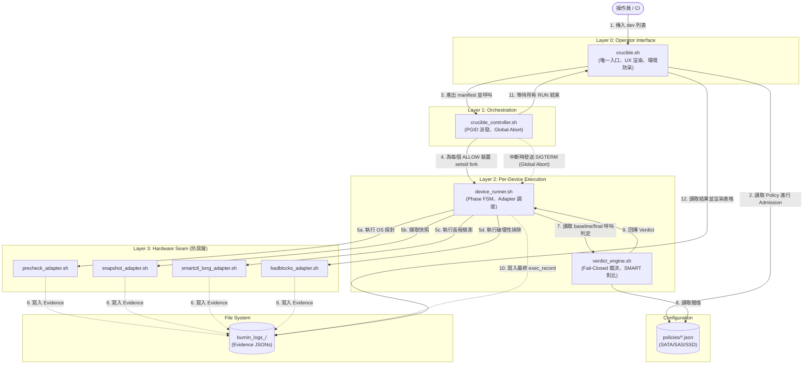

# NAS_CRUCIBLE 架構總覽 (Structure)

本文件描述 `NAS_CRUCIBLE` 的 4 層深度模組架構 (4-Layer Deep Module Architecture) 與資料流向。

## 核心系統架構圖

## 目錄與職責對照

| 目錄 / 檔案 | 職責說明 |
| :--- | :--- |
| `crucible.sh` | **CLI 接縫 (Operator Seam)**。負責硬碟分類 (ATA/SCSI)、Policy 匹配、並啟動背景控制器。 |
| `crucible_controller.sh` | **進程協調器**。負責 `setsid` 隔離、追蹤 PGID，並在 `Ctrl+C` 時觸發 Global Abort，防止失控寫入。 |
| `device_runner.sh` | **單碟狀態機**。管理 `precheck` → `baseline` → `smart` → `badblocks` → `final` 的嚴格管線與 Fail-Closed 狀態。 |
| `verdict_engine.sh` | **裁決引擎**。純資料處理器，根據 Policy 規則對比兩次 JSON 快照，判斷是否 PASS。 |
| `adapters/*.sh` | **硬體防腐層 (Hardware Seam)**。將雜亂的 OS 指令轉譯為標準化、強型別的 JSON Evidence。 |
| `policies/*.json` | **策略定義檔**。定義不同 Device Class (如 SAS_SSD) 的 timeout 與 SMART 判定規則 (Verdict Rules)。 |
| `lib/device_probe.sh` | **共用探針**。集中提供安全的硬碟可達性檢查 (is_device_accessible)。 |
| `logs/` | **不可變證據 (Immutable Evidence)**。保存每一次測試的原始 JSON，保證重啟或當機可追溯。 |

## 資料流與合約 (JSON Contracts)

系統內部完全捨棄 Bash 變數傳遞複雜狀態，改以 JSON 作為各層的契約 (Evidence-based)：
1. **Admission Contract:** `crucible.sh` 產出 `device_manifest.json` 交給 Controller。
2. **Adapter Contract:** 每個 Adapter 必定產出 `<serial>_<phase>_evidence.json`。
3. **Verdict Contract:** Verdict Engine 產出標準化的 `verdict_evidence.json` 供 CLI 渲染結果。
